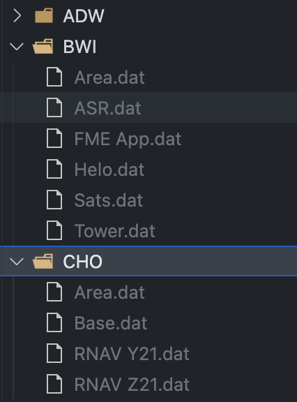
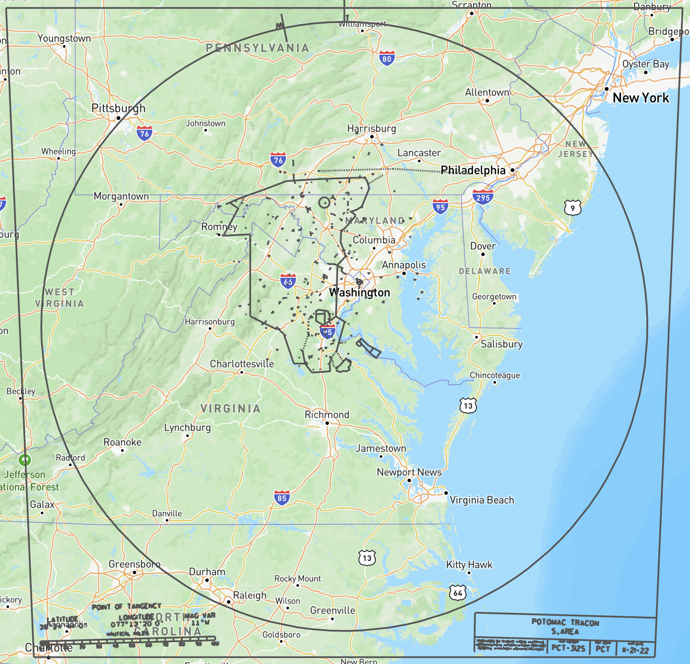

# DATtoGeoJSON

A simple Python-based FAA DAT to GeoJSON Converter.

## Limitations

The DAT files that I was provided assume that coordinates are N Lat and W Lon, so the W coordinates are positive. This will not work for facilities at/near the antimeridian until I can see how that case is handled in DAT files from that area.

## Requirements

Python3 (Tested with Python 3.9.13)

Only imports are OS, Argparse, and Math, so it should run on a standard Python implementation.

## Instructions for use

To process files for a single facility:

1. Place the DAT files in the `dat_source` directory.
2. Run the following command:
   <br/>
   ```
   python3 convert.py [--radius X (default 140)]
   ```

To process multiple facilities at once:

1. Create folders for each facility in the `dat_source` directory.
2. Place the DAT files for each facility in their respective facility folders.
   <br/>**Note:** the script will use the file names as the export name (e.g. `/dat_source/IAD/Base.dat` will be saved as `/output/IAD_Base.geojson`)
   <br/>
3. Run the following command:
   <br/>
   ```
   python3 convert.py [--radius X (default 140)]
   ```

### Optional Command Line Arguments

The optional `--radius X` argument is provided because the DAT files include everything that is also shown in the PDF accompanying the DAT file, to include the border and text at the bottom left and right. This border is generally around 150NM from the center point (point of tangency) declared in the file, and there is a radial line showing MAG versus TRUE that extends inside of the border, necessitating a radius smaller than the border itself. The radius may be smaller for smaller TRACONS or Towers, so the default of 140 can be overridden by passing `--radius X`, where `XX` is an integer representing the NM from the center of the map. Example: `python3 convert.py --radius 50`
<br/>

<p align="center">

</p>

# Contributions

Want to contribute? Check out the [Open Issues](https://github.com/misterrodg/DATtoGeoJSON/issues), or fork and open a [Pull Request](https://github.com/misterrodg/DATtoGeoJSON/pulls).

Additional contributors will be listed here.

# License

This is licensed under GPL 3.0.
